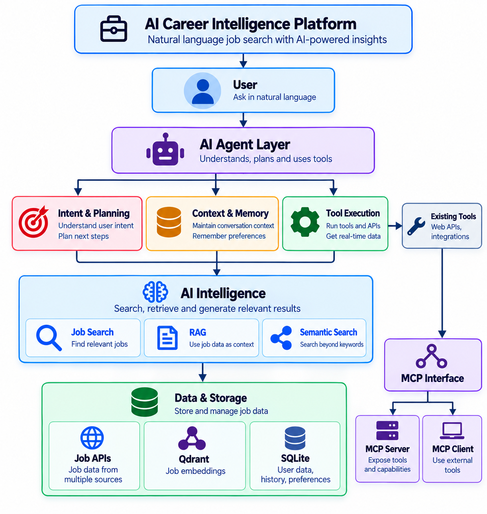

# AI Career Intelligence Platform

An AI-powered job intelligence system built to automate job discovery, intelligent search, career insights, and job application workflows.

The **core AI architecture is already implemented and tested**, including LLM orchestration, AI agents, RAG, semantic retrieval, Qdrant, persistent context, tool execution, workflow actions, and MCP. The project is now expanding toward broader career intelligence and production deployment.

**Status: Active Development**  
**Core Architecture: Implemented and Tested**

---

## Architecture Overview

<pre align="center">
                        <p align="center">
  
</p></pre>

---

## Quick Start

### Clone

```bash
git clone https://github.com/subodhin/rag-job-intelligence-system.git
cd rag-job-intelligence-system
```

### Create and activate virtual environment

```bash
python3 -m venv env
source env/bin/activate
```

### Start Qdrant

```bash
docker run -p 6333:6333 -p 6334:6334 qdrant/qdrant
```

### Start the API

```bash
python -m app.main
```

### Open Swagger UI

```text
http://localhost:8000/docs
```

---

## What I Built

| Engineering Area | Implementation |
|:---|:---|
| **AI Agents** | Intent detection · routing · tool execution · workflow actions |
| **LLM Orchestration** | Groq for intent/planning · Ollama/Phi for local generation |
| **RAG** | Retrieval → context construction → grounded generation |
| **Semantic Retrieval** | `nomic-embed-text` · 768-D embeddings · cosine similarity |
| **Vector Database** | FAISS → Qdrant migration with retrieval validation |
| **Context & Memory** | Persistent profiles · preferences · conversation history |
| **Query Planning** | Natural language → structured search filters |
| **Tool Execution** | Structured Python tools with agent-driven routing |
| **Job Workflows** | Save jobs · track applications · retrieve saved jobs |
| **Persistent State** | SQLite-based job and application tracking |
| **MCP** | MCP server · client · tool discovery · multi-tool workflows |
| **Backend** | Python · FastAPI · Pydantic · modular services |
| **Data Integration** | External job APIs · normalized job data |
| **Career Insights** | Skill and salary analysis |

---

## Architecture

### AI Search & RAG

<pre align="center">
User
 │
 ▼
AI Agent
 │
 ├── Intent Detection
 │
 └── Query Planning
          │
          ▼
   Job Search / Semantic Search
          │
          ▼
        Qdrant
          │
          ▼
     RAG Context
          │
          ▼
      Ollama / Phi
          │
          ▼
   Grounded Response
</pre>

### Context-Aware AI

<pre align="center">
User Query
    │
    ▼
User Context
    │
    ├── Profile
    ├── Skills
    ├── Preferences
    └── Conversation History
    │
    ▼
Intent Detection
    │
    ▼
Query Planning
    │
    ▼
Personalized Job Retrieval
</pre>

### Job Action Workflow

<pre align="center">
User
 │
 ▼
AI Agent
 │
 ▼
Intent + Context
 │
 ▼
Action Agent
 │
 ▼
Tool Router
 │
 ▼
Job Action Tool
 │
 ▼
SQLite
 │
 ▼
Action Result
 │
 ▼
AI Response
</pre>

### MCP Integration

<pre align="center">
MCP Client
    │
    ▼
MCP Server
    │
    ▼
Existing Application Tools
    │
    ├── Job Search
    ├── Semantic Search
    ├── Save Job
    ├── Track Job
    └── Get Saved Jobs
</pre>

MCP is integrated as an additional interface over the existing tool layer rather than replacing the application's business logic.

---

## Key Engineering Work

### 1. AI Agent Architecture

Implemented an agent workflow that can:

- Detect user intent
- Route requests to appropriate tools
- Execute structured actions
- Use previous search results and user context
- Produce grounded responses

<pre align="center">
Natural Language
      ↓
Intent Detection
      ↓
Agent Routing
      ↓
Tool Selection
      ↓
Tool Execution
      ↓
Response
</pre>

---

### 2. RAG + Semantic Retrieval

Implemented two retrieval approaches.

**Structured retrieval**

<pre align="center">
Natural Language
      ↓
Query Planner
      ↓
Structured Filters
      ↓
Job Search
</pre>

**Semantic retrieval**

<pre align="center">
Natural Language
      ↓
Embedding
      ↓
Qdrant
      ↓
Cosine Similarity
      ↓
Relevant Jobs
</pre>

The system uses `nomic-embed-text` embeddings with 768-dimensional vectors.

FAISS was used as the initial vector retrieval implementation and Qdrant was introduced as the persistent vector database layer. Both implementations were compared during migration to validate retrieval consistency.

---

### 3. Context & Memory

Implemented persistent user context using SQLite.

Stored context includes:

<pre align="center">
User Profile
    ├── Target Role
    ├── Experience
    └── Skills

Preferences
    ├── Locations
    ├── Remote Preference
    └── Preferred Skills

Conversation History
</pre>

This allows vague follow-up queries such as:

```text
"Show me some jobs"
```

to be interpreted using previously stored user context rather than treating every request independently.

---

### 4. AI Workflow Actions

The agent can interact with persistent application state.

Implemented actions:

```text
save_job
track_job
get_saved_jobs
```

Example workflow:

<pre align="center">
Find Job
   ↓
Save Job
   ↓
Track Application
   ↓
Retrieve Saved Jobs
</pre>

Job state is persisted in SQLite.

---

### 5. MCP Integration

Implemented an MCP server and client using the Python MCP SDK.

Exposed tools:

```text
get_saved_jobs_mcp
save_job_mcp
track_job_mcp
search_jobs_mcp
semantic_job_search_mcp
```

Validated:

- MCP initialization
- Tool discovery
- Structured job search
- Semantic search
- Job saving
- Application tracking
- Saved-job retrieval
- Multi-tool execution
- End-to-end MCP workflow
- Regression testing of the existing job-action workflow

The MCP implementation reuses the existing application tools, keeping business logic centralized.

---

## Context-Aware Search

The platform maintains persistent user context including:

- Profile
- Experience
- Skills
- Search preferences
- Preferred locations
- Conversation history

This context is used during query planning and job retrieval to support personalized, multi-turn interactions.

Example:

```text
User:
"Show me some jobs"

Context:
Role = AI Engineer
Skills = Python, RAG
Location = Remote

Planner:
{
  "title": "AI Engineer",
  "skills": ["Python", "RAG"],
  "location": "remote"
}
```

---

## Current Capabilities

| Capability | Status |
|:---|:---:|
| FastAPI backend | Complete |
| Natural-language job search | Complete |
| Intent detection | Complete |
| Agent routing | Complete |
| Tool execution | Complete |
| RAG | Complete |
| Semantic retrieval | Complete |
| FAISS → Qdrant migration | Complete |
| Persistent user context | Complete |
| Context-aware query planning | Complete |
| Profile / preference-aware search | Complete |
| Multi-turn conversations | Complete |
| Job save / tracking | Complete |
| Persistent job state | Complete |
| Structured search | Complete |
| Semantic search | Complete |
| External job API integration | Complete |
| MCP server | Complete |
| MCP client | Complete |
| MCP tool discovery | Complete |
| MCP multi-tool workflow | Complete |
| MCP end-to-end workflow | Complete |

---

## Testing

### Start API

```bash
uvicorn app.main:app --reload
```

### Test Qdrant

```bash
python3 -m app.scripts.test_qdrant_collection
```

### Test Semantic Retrieval

```bash
python3 -m app.scripts.test_qdrant_semantic_search
```

### Compare FAISS and Qdrant

```bash
python3 -m app.scripts.compare_faiss_qdrant
```

### Test Agent Tools

```bash
python3 -m app.scripts.test_tool_router
```

### Test MCP

```bash
python -m app.mcp.test_client
```

### Inspect Persistent Context

```bash
python3 -c "from app.context.context_service import get_user_context, print_user_context; print_user_context(get_user_context('user_002'))"
```

### Test Job Action Workflow

```bash
python -c "from app.agents.action_agent import handle_job_action; from app.context.context_service import get_user_context; print(handle_job_action('Save the first job', get_user_context('user_002')))"
```

---

## Tech Stack

| Category | Technology |
|:---|:---|
| **Language** | Python |
| **API** | FastAPI |
| **LLM** | Groq · Ollama / Phi |
| **Embeddings** | `nomic-embed-text` |
| **RAG** | Retrieval-Augmented Generation |
| **Vector Database** | Qdrant |
| **Vector Retrieval** | FAISS |
| **AI Architecture** | Agents · Routing · Tool Execution |
| **Protocol** | MCP |
| **Database** | SQLite |
| **Validation** | Pydantic |
| **Infrastructure** | Docker |
| **Data Sources** | External Job APIs |

---

## Project Structure

```text
app/
├── agents/
│   ├── action_agent.py
│   └── ...
│
├── context/
│   ├── database.py
│   ├── context_service.py
│   └── router.py
│
├── mcp/
│   ├── server.py
│   └── test_client.py
│
├── services/
│   ├── semantic_search_service.py
│   ├── agent_response_service.py
│   └── ...
│
├── tools/
│   ├── job_tools.py
│   ├── tool_router.py
│   └── tool_registry.py
│
└── main.py
```

---

## What's Next

- Multiple job boards and broader job ingestion
- Resume parsing and job matching
- Skill-gap analysis
- Personalized job recommendations
- CV tailoring
- Learning recommendations
- Job-search dashboard
- PostgreSQL migration
- Hybrid retrieval and improved ranking
- Deployment
- Monitoring and observability

---

## Engineering Focus

`LLM Orchestration · AI Agents · RAG · Semantic Retrieval · Vector Databases · Tool Execution · MCP · Context & Memory · Workflow Automation · FastAPI · AI Backend Architecture`

## Direction

<pre align="center">
Job Discovery
      ↓
Intelligent Search
      ↓
Context-Aware AI
      ↓
Job Actions & Tracking
      ↓
Career Intelligence
      ↓
Personalized Career Automation
</pre>

---

## Project

**GitHub:** https://github.com/subodhin/rag-job-intelligence-system

## Author

**Subodhi Nanayakkara** — Software Engineer with 6+ years of experience in full-stack and backend engineering, currently focused on AI engineering.

This project represents a hands-on transition into AI engineering, combining software engineering experience with practical implementation of **LLMs, AI agents, RAG, semantic retrieval, vector databases, tool execution, context and memory, workflow automation, and MCP**.
